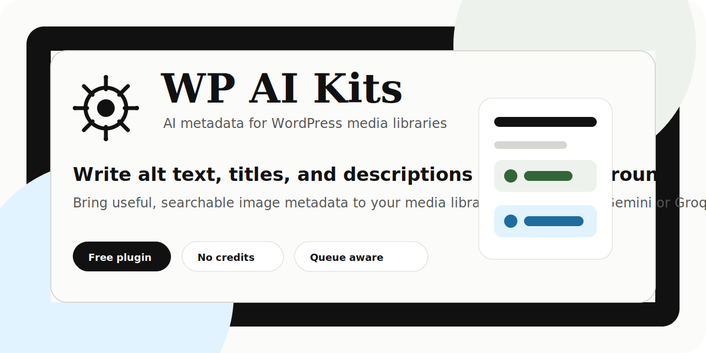

  

  <a href="https://wpaikits.site"><strong>Website</strong></a>
  |
  <a href="#quick-start"><strong>Quick Start</strong></a>
  |
  <a href="#privacy-and-ai-providers"><strong>Privacy</strong></a>
  |
  <a href="#roadmap"><strong>Roadmap</strong></a>

  
  
  
  

# WP AI Kits

WP AI Kits is a focused WordPress plugin that writes useful image metadata for your Media Library.

The free release includes **Media AI Kit**: background generation for image alt text, titles, and descriptions using your own AI provider key.

No credit wallet. No per-image billing. No mystery queue. Just your WordPress site, your API key, and a background worker that knows how to slow down when providers get busy.

## What It Does

- Generates concise, screen-reader-friendly alt text.
- Adds searchable media titles and descriptions.
- Processes existing image libraries in the background.
- Handles new uploads automatically.
- Supports provider fallback so one busy route does not stop the job.
- Shows live activity logs for generated, skipped, and failed images.
- Lets you decide whether existing metadata should be preserved or overwritten.

## Why It Exists

Most WordPress media libraries are full of images named `IMG_4821.jpg`, empty alt fields, and descriptions nobody had time to write.

WP AI Kits turns that backlog into a controlled background task. It helps site owners improve accessibility, searchability, and editorial workflow without sending the whole site through a black-box SaaS layer.

## Quick Start

1. Download or clone this repository.
2. Upload the plugin folder to `wp-content/plugins/`.
3. Activate **WP AI Kits** in WordPress.
4. Open **WP AI Kits** in wp-admin.
5. Add a Gemini, Groq, or compatible vision provider key.
6. Open **Media AI Kit** and start a background sync.

## Built For Real Libraries

Media AI Kit is designed for sites with more than a few demo images.

- The queue spaces requests to respect free-tier provider limits.
- Cooldowns are detected and handled automatically.
- Failed images can be retried.
- The activity log explains what happened.
- Existing human-written metadata is protected by default.

## Privacy And AI Providers

WP AI Kits only connects to AI providers after an administrator adds credentials and starts using the related features.

Images are sent from your server to the provider you configure. Review the terms and data policies of each provider before processing sensitive media.

The plugin stores recent redacted AI diagnostics locally for troubleshooting, then prunes them automatically.

## Free And Pro

This public repository contains the free plugin.

The free plugin includes:

- Media metadata generation
- Background processing
- Provider routing
- Activity logs
- Per-field overwrite controls

Pro features, such as semantic media search and editor AI tools, are distributed separately.

## Roadmap

- WordPress.org release package.
- Better onboarding for provider setup.
- More media workflow controls.
- Optional Pro add-on for semantic media search and editor automation.

## Useful Links

- Website: https://wpaikits.site
- GitHub: https://github.com/yasserzakaria/wpaikits
- License: GPLv2 or later

## Contributing

Issues and practical feedback are welcome. The best reports include:

- WordPress version
- PHP version
- Active provider/model
- What you clicked
- What appeared in the activity log

## License

WP AI Kits is licensed under GPLv2 or later.
